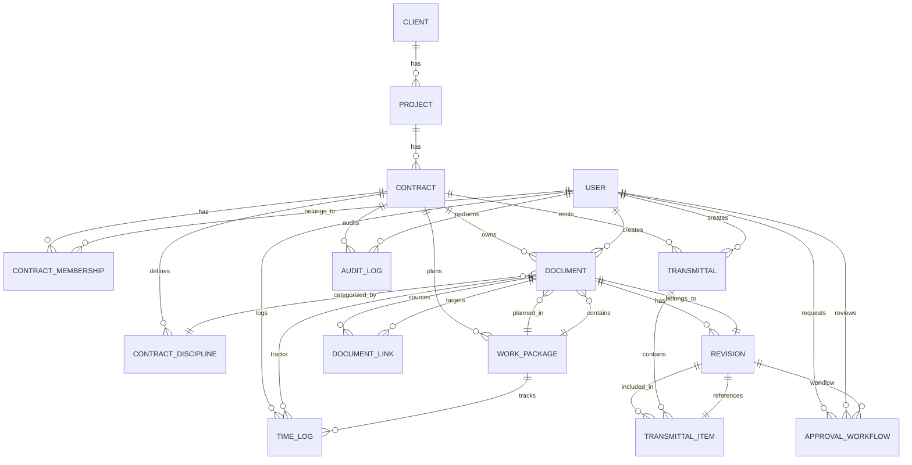
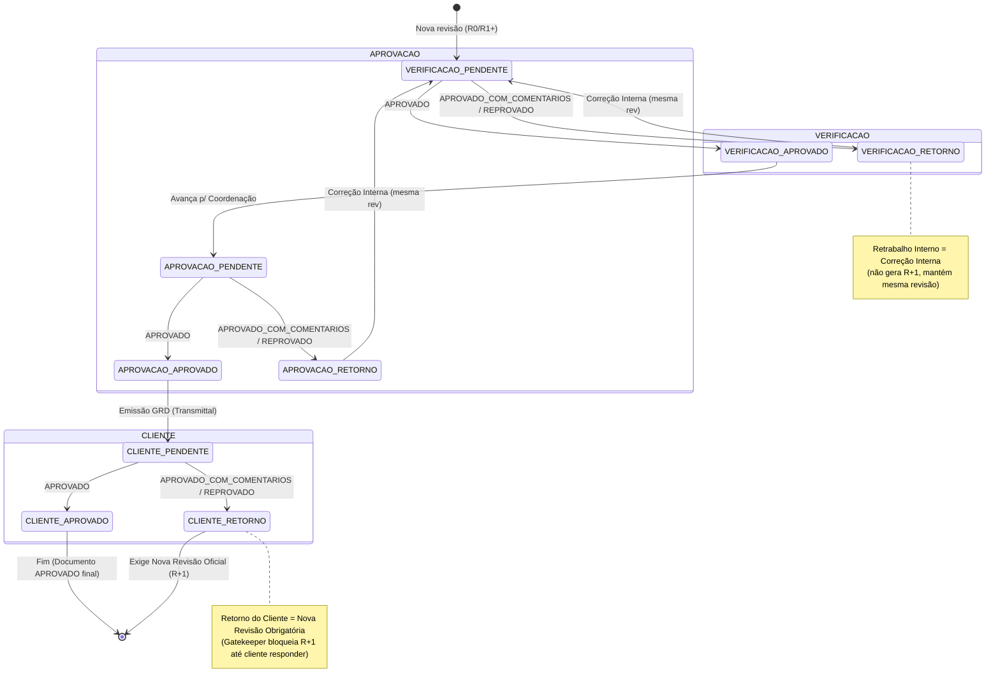
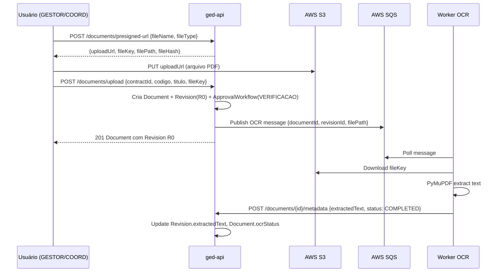
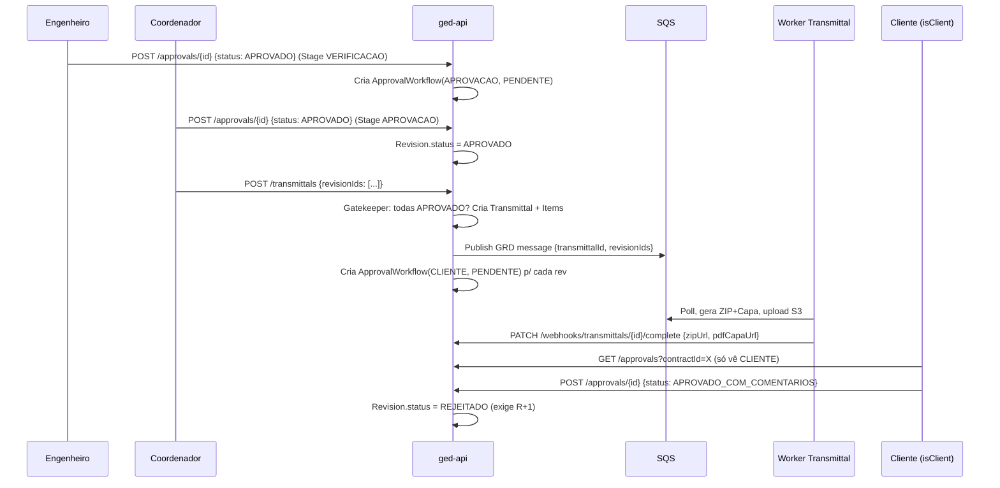
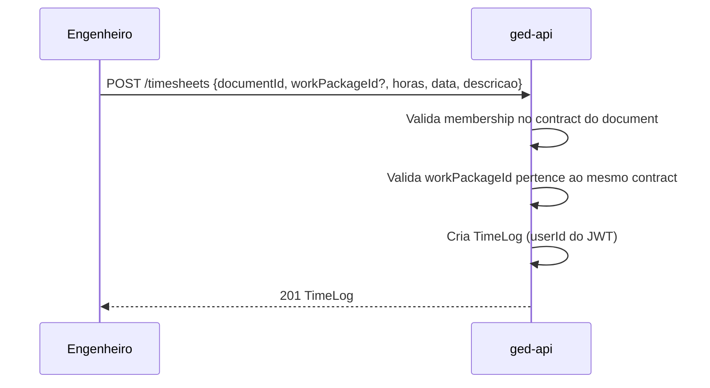

# GED Engenharia — Modelo de Domínio (Domain Model)

**Versão:** 1.0 (Baseado no schema Prisma atual)  
**Data:** 2026-09-24  
**Fonte:** `prisma/schema.prisma` (384 linhas)

---

## 1. Visão Geral do Domínio

O domínio **GED Engenharia** modela a gestão de documentos técnicos para empresas de engenharia multidisciplinar, com foco em:

- **Hierarquia contratual:** Cliente → Projeto → Contrato (unidade de isolamento/tenant)
- **Ciclo de vida do documento:** Cadastro (shell) → Upload R0 → Workflow de aprovação (3 estágios) → Revisões oficiais (R1, R2...) → Emissão GRD → Análise do Cliente
- **Governança:** RBAC por papel no contrato, auditoria imutável, isolamento multi-tenant

---

## 2. Aggregates e Entidades

### 2.1 Aggregate: **Contract** (Tenant Root)

```
Contract (Aggregate Root)
├── ContractDiscipline[] (Disciplinas do contrato)
├── ContractMembership[] (Membros + Roles)
├── Document[] (Acervo técnico)
├── Transmittal[] (GRDs emitidas)
├── WorkPackage[] (Pacotes de planejamento)
└── AuditLog[] (Trilha de auditoria)
```

**Regras de Negócio:**
- Unidade de isolamento multi-tenant — todos os dados pertencem a um `Contract`
- `Contract.codigo` único globalmente (ex: `VALE-2026-ENG`)
- Vínculo opcional a `Project` (retrocompatibilidade com contratos legados)
- Apenas `GESTOR` pode criar/editar/deletar disciplinas e convidar usuários

### 2.2 Aggregate: **Document** (Dentro de Contract)

```
Document
├── Revision[] (Histórico imutável: R0, R1, R2...)
│   └── ApprovalWorkflow[] (Carimbos por estágio)
├── ContractDiscipline? (Disciplina técnica)
├── WorkPackage? (Pacote de planejamento)
├── TimeLog[] (Apontamento de horas)
├── DocumentLink[] (Relacionamentos: referência, anexo)
└── Metadata (OCR/Extração)
    ├── ocrStatus: PENDING | PROCESSING | COMPLETED | FAILED
    ├── projectNumber?
    ├── extractedRevision?
    └── extractedMetadata? (JSON bruto Textract)
```

**Regras de Negócio:**
- `codigoDocumento` único por `contractId` (ex: `VALE-CIV-PLA-001`)
- **Shell Document:** Criação sem `fileKey` — apenas metadados (MDR placeholder)
- Revisão inicial (R0) criada junto com upload físico
- Nova revisão oficial (R1+) **só permitida** após ciclo `CLIENTE` concluído (Gatekeeper Épico 10.3)
- Correção Interna: substitui arquivo da **mesma revisão**, reinicia `VERIFICACAO` (não cria R+1)

### 2.3 Aggregate: **Revision** (Dentro de Document)

```
Revision
├── versionLabel: String (ex: "R0", "R1", "A", "B")
├── filePath: String (URL S3 pública)
├── fileHash: String (SHA-256/hex 32 chars — integridade)
├── status: RevisionStatus
├── extractedText? (Text — Full-text search Épico 13)
├── ApprovalWorkflow[] (Histórico completo de carimbos)
└── TransmittalItem[] (Participação em GRDs)
```

**RevisionStatus Flow:**
```
EM_ELABORACAO → EM_REVISAO → APROVADO
                    ↓
               REJEITADO (retorno interno)
                    ↓
              (Correção Interna) → EM_REVISAO
```

### 2.4 Entity: **ApprovalWorkflow** (State Machine — Épico 10)

```
ApprovalWorkflow
├── revisionId (FK)
├── requesterId (User)
├── reviewerId? (User)
├── status: ApprovalStatus (PENDENTE | APROVADO | APROVADO_COM_COMENTARIOS | REPROVADO)
├── stage: ApprovalStage (VERIFICACAO | APROVACAO | CLIENTE)
├── isClient: Boolean (ator externo vs interno)
├── comments? (justificativa técnica)
├── commentedFileUrl? (PDF anotado no S3)
├── requestedAt
└── reviewedAt?
```

**Máquina de Estados (por Stage):**

| Stage Atual | Ação | Próximo Stage | Novo RevisionStatus |
|-------------|------|---------------|---------------------|
| `VERIFICACAO` | `APROVADO` | `APROVACAO` | `EM_REVISAO` |
| `VERIFICACAO` | `APROVADO_COM_COMENTARIOS` / `REPROVADO` | — (fim) | `REJEITADO` |
| `APROVACAO` | `APROVADO` | — (fim interno) | `APROVADO` |
| `APROVACAO` | `APROVADO_COM_COMENTARIOS` / `REPROVADO` | — (fim) | `REJEITADO` |
| `CLIENTE` | `APROVADO` | — (fim final) | `APROVADO` |
| `CLIENTE` | `APROVADO_COM_COMENTARIOS` / `REPROVADO` | — (fim) | `REJEITADO` (exige R+1) |

**Regra Crítica:** Cada carimbo é um **novo registro** (histórico preservado, nunca sobrescrito).

### 2.5 Entity: **Transmittal** (GRD — Guia de Remessa de Documentos)

```
Transmittal
├── codigo: String (auto: TR-0001, TR-0002...)
├── assunto, mensagem?, destinatario?, proposito
├── status: TransmittalStatus (EM_PROCESSAMENTO | CONCLUIDO | ERRO)
├── zipUrl?, pdfCapaUrl? (gerados pelo Worker Python)
├── TransmittalItem[] (Revision[] do lote)
└── createdBy (User)
```

**Gatekeeper de Emissão:** Todas as `Revision` do lote devem ter `status = APROVADO`.

**Pós-Emissão:** Cria `ApprovalWorkflow` stage `CLIENTE` para cada revisão (destrava análise do cliente).

### 2.6 Entity: **WorkPackage** (Planejamento — Épico 7)

```
WorkPackage
├── nome, descricao?
├── dataInicio, dataFim
├── status: String (PENDENTE | EM_ANDAMENTO | CONCLUIDO | ATRASADO)
├── Document[] (Documentos vinculados)
└── TimeLog[] (Horas apontadas no pacote)
```

### 2.7 Entity: **TimeLog** (Apontamento — Épico 9)

```
TimeLog
├── userId (sempre do JWT — nunca do body)
├── documentId? (FK opcional)
├── workPackageId? (FK opcional)
├── horas: Float
├── data: DateTime
├── descricao: String
└── createdAt, updatedAt
```

**Regra:** `userId` extraído do token autenticado. Usuário só aponta em documentos do seu contrato.

### 2.8 Entity: **AuditLog** (Trilha — Épico 12)

```
AuditLog
├── action: String (UPLOAD_DOCUMENT, APPROVE_REVISION, EMIT_GRD, ...)
├── entity: String (Document, Revision, ApprovalWorkflow, Transmittal)
├── entityId: Int
├── details: Json (metadados contextuais)
├── ipAddress?
├── userId (FK)
├── contractId (FK — multi-tenant)
└── createdAt
```

**Imutável:** Apenas `CREATE` — nunca `UPDATE`/`DELETE`.

### 2.9 Entity: **DocumentLink** (Relacionamentos — Épico 9)

```
DocumentLink
├── sourceDocId (Document)
├── targetDocId (Document)
├── tipo: String (REFERENCIA | ANEXO | SUPERSEDE | COMPLEMENTA)
└── createdAt
```

**Único:** `(sourceDocId, targetDocId)` — sem duplicatas.

---

## 3. Value Objects / Enums

### 3.1 ContractRole (RBAC no Contrato)

| Role | Permissões Principais |
|------|----------------------|
| `GESTOR` | Total: cria documento, disciplina, convida usuário, aprova tudo, vê auditoria |
| `COORDENADOR` | Cria documento, aprova (Stage 2), emite GRD, gerencia planejamento |
| `ENGENHEIRO` | Verificação técnica (Stage 1), aponta horas, correção interna |
| `PLANEJADOR` | Gerencia WorkPackage, aponta horas, não aprova documento técnico |
| `LEITOR` | Apenas visualiza/baixa |

### 3.2 GlobalRole (Sistema)

| Role | Descrição |
|------|-----------|
| `SYSADMIN` | Dono do SaaS — acesso cross-tenant (não implementado no código atual) |
| `USER` | Usuário comum — permissões via `ContractMembership` |

### 3.3 User.isClient (Portal do Cliente — PATCH 10.4)

| Valor | Comportamento |
|-------|---------------|
| `false` (default) | Membro do time interno — vê tudo do contrato |
| `true` | Ator externo (Cliente) — **só vê documentos com stage `CLIENTE`**; carimbos internos filtrados |

---

## 4. Regras de Domínio Críticas

### 4.1 Isolamento Multi-Tenant (Contrato = Tenant)

```
┌─────────────────────────────────────────────────────────────┐
│                    CONTRACT (Tenant)                        │
│  ┌─────────┐  ┌─────────┐  ┌─────────┐  ┌─────────────┐    │
│  │Document │  │Transmitt│  │WorkPkg  │  │AuditLog     │    │
│  │         │  │al       │  │         │  │             │    │
│  └────┬────┘  └────┬────┘  └────┬────┘  └──────┬──────┘    │
│       │            │            │             │             │
│       ▼            ▼            ▼             ▼             │
│  ┌─────────────────────────────────────────────────────┐   │
│  │              ContractMembership (RBAC)              │   │
│  └─────────────────────────────────────────────────────┘   │
└─────────────────────────────────────────────────────────────┘
```

**Implementação Atual:** Prisma Extension + AsyncLocalStorage injeta `contractId` automaticamente.

**Alvo:** PostgreSQL RLS (Row Level Security) — isolamento no banco.

### 4.2 Gatekeeper de Nova Revisão (R+1) — Épico 10.3

```typescript
// Só permite nova revisão oficial se:
const canCreateNewRevision = 
  !hasOpenPendingApprovals &&           // Nenhum carimbo PENDENTE
  (clientCycleDone || legacyApproved);  // Cliente finalizou OU legacy APROVADO sem workflow
```

**Correção Interna (PATCH 10.3):** Permitida apenas quando último carimbo interno (`VERIFICACAO`/`APROVACAO`) retornou `REPROVADO` ou `APROVADO_COM_COMENTARIOS`. Substitui arquivo, reinicia `VERIFICACAO`.

### 4.3 Portal do Cliente — Isolamento Visual (PATCH 10.4)

```typescript
// Listagem/Detalhamento para isClient=true:
where: {
  revisions: {
    some: {
      approvalWorkflows: { some: { stage: ApprovalStage.CLIENTE } }
    }
  }
}

// Sanitização na resposta:
revision.approvalWorkflows = workflows.filter(w => w.stage === CLIENTE);
```

**Resultado:** Cliente **nunca vê** documentos em elaboração, verificação ou aprovação interna — apenas os emitidos via GRD.

### 4.4 OCR / Full-Text Search (Épico 5 + 13)

```
Upload Revision → SQS (documentId, revisionId, filePath)
                    ↓
Worker Python (PyMuPDF) → Extrai texto completo
                    ↓
Webhook → Revision.extractedText + Document.ocrStatus = COMPLETED
                    ↓
Busca: revisions.some.extractedText.contains(termo)
```

---

## 5. Diagramas de Relacionamento (Mermaid)

### 5.1 Core Domain — Contract Centric



### 5.2 Approval Workflow State Machine



---

## 6. Fluxos de Negócio Principais

### 6.1 Cadastro de Documento (Shell → R0 → Aprovação)



### 6.2 Aprovação Interna → Emissão GRD → Análise Cliente



### 6.3 Apontamento de Horas (Timesheet)



---

## 7. Mapeamento para Código Atual

| Domain Concept | Prisma Model | Controller | Service | Frontend Feature |
|----------------|--------------|------------|---------|------------------|
| Contract | `Contract` | `project.controller.ts` | — | `contracts/` |
| ContractDiscipline | `ContractDiscipline` | `management.controller.ts` | `ManagementService` | `management/` |
| User + Membership | `User`, `ContractMembership` | `auth`, `management` | — | `auth`, `management` |
| Document | `Document` | `document.controller.ts` | `DocumentService` | `documents/` |
| Revision | `Revision` | `document.controller.ts` | — | `documents/DocumentDetail` |
| ApprovalWorkflow | `ApprovalWorkflow` | `approval.controller.ts` | — | `documents/ApprovalDashboard` |
| Transmittal | `Transmittal` | `transmittal.controller.ts` | — | `transmittals/` |
| WorkPackage | `WorkPackage` | `planning.controller.ts` | `PlanningService` | `planning/` |
| TimeLog | `TimeLog` | `timesheet.controller.ts` | `TimesheetService` | `documents/Timesheet*` |
| AuditLog | `AuditLog` | `audit.controller.ts` | `AuditService` | `audit/` |
| DocumentLink | `DocumentLink` | — (não exposto) | — | — (não implementado no FE) |

---

## 8. Gaps no Modelo Atual vs. Domínio Completo

| Conceito de Domínio | Status | Gap |
|---------------------|--------|-----|
| **Cliente (Pessoa Jurídica)** | ✅ `Client` model | OK |
| **Projeto** | ✅ `Project` model | OK |
| **Contrato (Tenant)** | ✅ `Contract` model | OK |
| **Disciplina por Contrato** | ✅ `ContractDiscipline` | OK |
| **Usuário Global** | ✅ `User` | OK |
| **Membership + Role** | ✅ `ContractMembership` | OK |
| **Documento Técnico** | ✅ `Document` | OK |
| **Revisão Física** | ✅ `Revision` | OK |
| **Workflow Aprovação (3 estágios)** | ✅ `ApprovalWorkflow` | OK |
| **GRD / Transmittal** | ✅ `Transmittal` + `TransmittalItem` | OK |
| **Planejamento (WorkPackage)** | ✅ `WorkPackage` | OK |
| **Apontamento Horas** | ✅ `TimeLog` | OK |
| **Relacionamentos Doc↔Doc** | ✅ `DocumentLink` | Parcial (FE não expõe) |
| **Auditoria Imutável** | ✅ `AuditLog` | OK |
| **OCR/Full-Text** | ✅ `Revision.extractedText` + `Document.ocrStatus` | OK |
| **Soft Delete** | ❌ | **Faltando** — hard delete em tudo |
| **Versionamento Metadados Doc** | ❌ | `codigoDocumento`, `titulo` mutáveis sem histórico |
| **Idempotency Keys** | ❌ | Upload duplicado possível |
| **Refresh Tokens** | ❌ | JWT-only, 1 dia, sem rotação |
| **Notificações/Eventos** | ❌ | Polling no FE, sem push/email |
| **Nomenclatura ISO 19650** | ❌ | Validação de `codigoDocumento` livre |
| **Marcas d'água / DRM** | ❌ | Download direto S3 sem proteção |
| **Visualizador DWG** | ❌ | Planejado Épico 14 |
| **Markup/Redlining** | ❌ | Planejado Épico 14 |
| **PWA/Offline** | ❌ | Planejado Épico 15 |

---

## 9. Convenções de Nomenclatura (Domain Language)

| Termo em Português | Termo no Código | Entidade Relacionada |
|--------------------|-----------------|---------------------|
| Cliente | `Client` | `Client` |
| Projeto | `Project` | `Project` |
| Contrato / Obra | `Contract` | `Contract` (Tenant) |
| Disciplina | `ContractDiscipline` | `ContractDiscipline` |
| Membro / Permissão | `ContractMembership` | `ContractMembership` |
| Documento Técnico | `Document` | `Document` |
| Revisão | `Revision` | `Revision` |
| Carimbo / Aprovação | `ApprovalWorkflow` | `ApprovalWorkflow` |
| Etapa do Carimbo | `ApprovalStage` | `VERIFICACAO` \| `APROVACAO` \| `CLIENTE` |
| Guia de Remessa | `Transmittal` (GRD) | `Transmittal` |
| Item da GRD | `TransmittalItem` | `TransmittalItem` |
| Pacote de Trabalho | `WorkPackage` | `WorkPackage` |
| Apontamento de Horas | `TimeLog` | `TimeLog` |
| Trilha de Auditoria | `AuditLog` | `AuditLog` |
| Vinculo entre Docs | `DocumentLink` | `DocumentLink` |

---

## 10. Validações de Integridade (Domain Invariants)

| Invariante | Onde Validada | Status |
|------------|---------------|--------|
| `Document.codigoDocumento` unique per `contractId` | Prisma `@@unique([contractId, codigoDocumento])` | ✅ |
| `Contract.codigo` unique global | Prisma `@@unique([codigo])` | ✅ |
| `ContractDiscipline.codigo` unique per `contractId` | Prisma `@@unique([contractId, codigo])` | ✅ |
| `ContractMembership` unique per `userId+contractId` | Prisma `@@unique([userId, contractId])` | ✅ |
| `Transmittal.codigo` unique per `contractId` | Prisma `@@unique([contractId, codigo])` | ✅ |
| `TransmittalItem` unique per `transmittalId+revisionId` | Prisma `@@unique([transmittalId, revisionId])` | ✅ |
| `DocumentLink` unique per `sourceDocId+targetDocId` | Prisma `@@unique([sourceDocId, targetDocId])` | ✅ |
| Nova revisão só após ciclo Cliente | `document.controller.ts:240-274` (Gatekeeper) | ✅ |
| Correção interna só após retorno interno | `document.controller.ts:422-456` (Gatekeeper) | ✅ |
| GRD só com revisões APROVADO | `transmittal.controller.ts:59-72` (Gatekeeper) | ✅ |
| `TimeLog.userId` = JWT userId | `timesheet.service.ts:69` | ✅ |
| `TimeLog.workPackageId` same contract as document | `timesheet.service.ts:73-87` | ✅ |
| `Revision.fileHash` verificado no download | ❌ Não implementado | **Gap** |
| `extractedText` size limit | ❌ Sem limite (coluna `Text`) | **Gap** |

---

## 11. Extensibilidade Futura (Domain-Driven)

### 11.1 Novos Aggregates Planejados

| Aggregate | Propósito | Épico |
|-----------|-----------|-------|
| `Notification` | Centraliza email/push/in-app | 15 |
| `DocumentTemplate` | Máscaras de nomenclatura ISO 19650 | 15 |
| `MarkupSession` | Redlining colaborativo em PDF | 14 |
| `DwgViewer` | Visualizador CAD nativo | 14 |
| `ComplianceReport` | Relatórios ISO 19650 / ISO 9001 | 15 |
| `WebhookSubscription` | Integração ERP/PMO clientes | 15 |

### 11.2 Event Sourcing (Futuro)

Para auditoria completa e temporal queries, migrar `AuditLog` para **Event Store**:
- `DocumentCreated`, `RevisionUploaded`, `ApprovalDecided`, `GRDEmitted`
- Permite: "Como estava este documento em 2025-06-15?"
- Replay para reconstruir estado

---

> **Nota:** Este modelo reflete o **estado atual do código** (`prisma/schema.prisma`). Evoluções devem seguir ADRs e migrações versionadas.